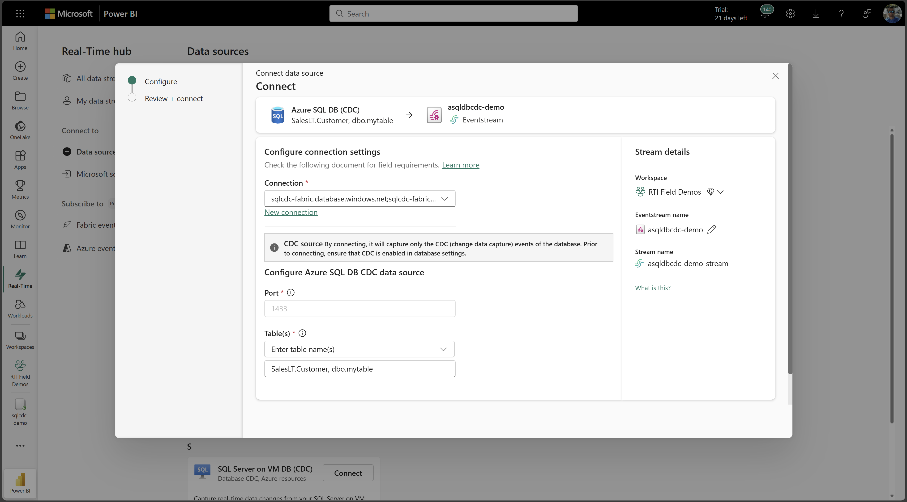
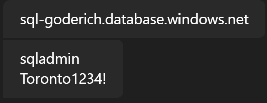
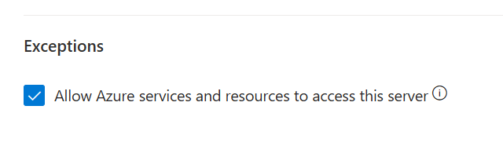

# CMF - Cummins
Repo for scripts & items used by CMF team to migrate to Fabric. 

1. [asqlsdb-cdc-setup.kql](asqlsdb-cdc-setup.sql)
2. Real-time Hub, setup eventstream.
3. [sqlcdc-demo.kql](sqlcdc-demo.kql)


### Eventstream

#### Considerations
- Increase throughput when necessary. [Learn more](https://learn.microsoft.com/fabric/real-time-intelligence/event-streams/configure-settings#event-throughput-setting)
- Create multiple Eventstreams with subset groups of tables or per single table depending on evenviroment needs.
- Eventstream transformations such as Manage Fields, Filter and Stream Processing may incur additional CUs.
- Screenshot above uses Direct Ingestion to Eventhouse, which means Eventhouse uses pull method from Eventstream via table batching policy config.


### Demo CDC
Server: 
```
sql-goderich.database.windows.net
```
Database: 
```
sqldb-goderich
```



