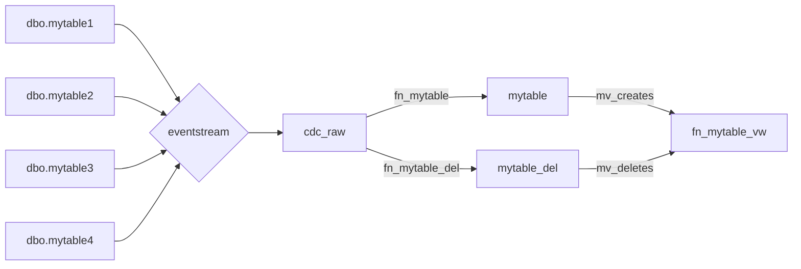
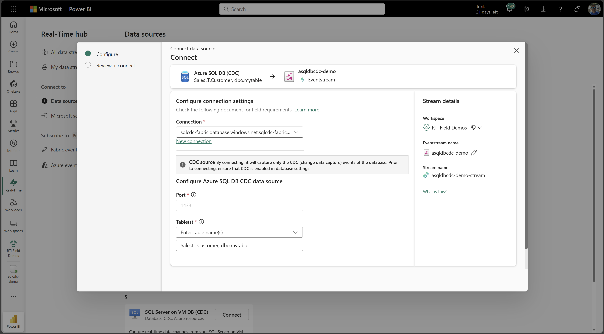
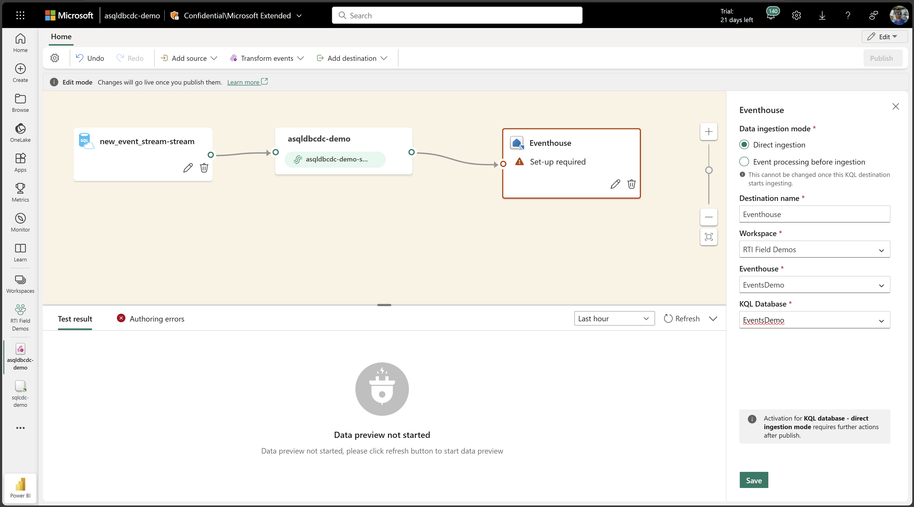
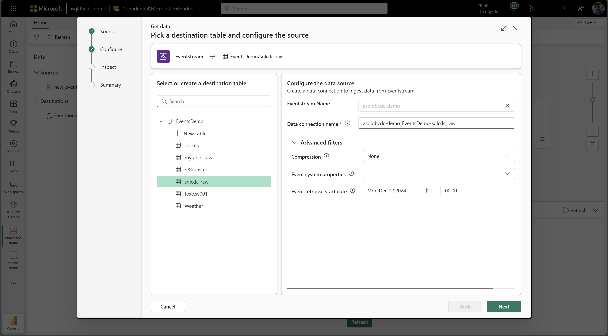
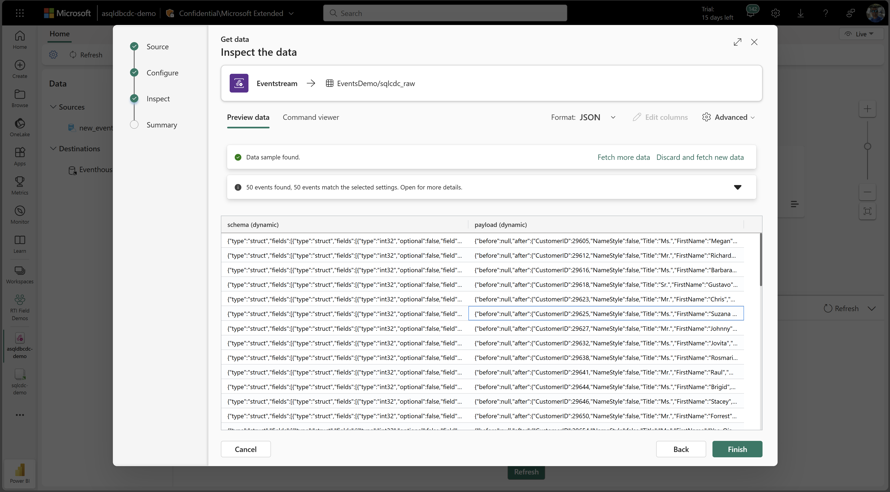
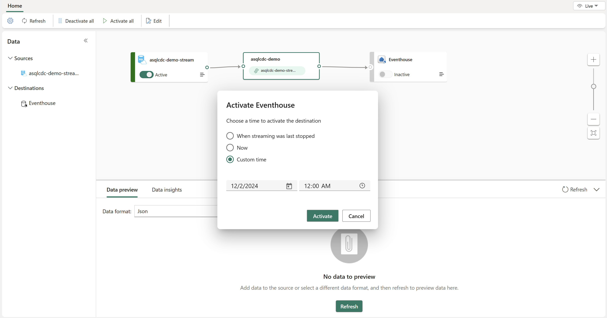

# Fabric RTI (Azure SQL Database CDC)
Scripts and items to migrate data from Azure SQL Database via CDC (Change Data Capture) connector in Fabric Real-Time Intelligence. 

Here we'll use the AdventureWorksLT database sample in Azure SQL Database service.

## Goal 
With minimal-latency, migrate multiple tables of same or varying schemas (columns, etc) by landing them into a single table in Fabric. 

## Steps 
1. Run [EnableCDC.sql](EnableCDC.sql). 
2. Setup Fabric RTI Eventstream.
3. Run [DMLChanges.sql](DMLChanges.sql)
4. Run [Queryset.kql](Queryset.kql)

### Step Eventstream Details⚡
1. Notice you can specificy the workspace and name the eventstream item.
2. Set the datasource connection and tables you'd like to capture.

4. Scroll down to click Next, Connect and Open Eventstream.
5. Add the destination (ie. Eventhouse, Lakehouse or Reflex). Here we'll cover eventhouse for minimal-latency and because the cdc stream is time-bound, but this may vary based on business needs and workload.
   

6. The eventhouse and workspace must be created prior to this step. Click Save & Publish. 
7. Configure new or existing destination table, set Event retrival start date to time just before creating the Eventstream, set table mapping and click Finish.

Screenshot above uses:
- Source: 2 tables of different schemas and volumes. One with a Clustered Primary Key and the other table is a heap without any indexes.
- Destination: Direct Ingestion to Eventhouse, which means Eventhouse uses pull method from Eventstream via table batching policy config. Alternatively, choose Event processing before ingestion for Streaming ingestion and deactivate & activate the destination to set an Event start time from when the stream was last stopped or custom datetime.
  

- Transformations: Done in Eventhouse via [step 4](Queryset.kql), ie. [Update Policy](https://learn.microsoft.com/fabric/real-time-intelligence/table-update-policy) and/or [Materialized-views](https://learn.microsoft.com/fabric/real-time-intelligence/materialized-view).

### Recommendations
- Normally the CDC data doesn't have high [throughput](https://learn.microsoft.com/fabric/real-time-intelligence/event-streams/configure-settings#event-throughput-setting), getting all tables' cdc into one Eventstream should be OK. 
- Regarding when to flatten or split the data, the proper approach is related to the business purpose wanted to achieve. If undecided to be split into different tables, then just sink to keep the original data without need to process inside Eventstream.
- Additional Eventstreams or transformations done up-stream such as Manage Fields, Filter and Stream Processing may incur additional CUs but allow the ability to take action over the data  in the stream by using Fabric Data Activator (Reflex).

## Proceed with remaining Steps.
3. Run [DMLChanges.sql](DMLChanges.sql)
4. Run [Queryset.kql](Queryset.kql)

## Thank you!

